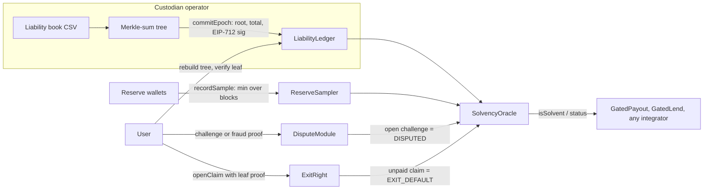

# ReserveProof

[](https://github.com/Assassin859/ReserveProof/actions/workflows/ci.yml)
[](https://github.com/Assassin859/ReserveProof/actions/workflows/ops-epoch.yml)

Open-source proof of reserves and proof of exit for custodians of **USDG** and **Robinhood Stock Tokens**.

**Live demo:** [reserveproof-teal.vercel.app](https://reserveproof-teal.vercel.app) (Kopi Wallet on Robinhood testnet and Arbitrum Sepolia)

- On-chain reserve reads (multi-sample + live balance)
- Merkle-sum liabilities with user inclusion / omission proofs
- Fail-closed `isSolvent(custodianId, asset)` that payouts and lending can `require`
- **ExitRight** — bonded withdrawal with on-chain `settle`

See [docs/technical-spec.md](docs/technical-spec.md) for the full design.

Hackathon packet: [docs/SUBMISSION.md](docs/SUBMISSION.md) · [docs/VERIFY.md](docs/VERIFY.md)

## How it works



1. **The custodian publishes** a sorted Merkle-sum root of what it owes per asset and per epoch, signed with a chain-agnostic EIP-712 commitment.
2. **The operator samples reserves.** `ReserveSampler.recordSample` is operator-gated; it records the reserve wallets' balances at several distinct blocks, and the oracle takes `min(samples, live balance)` against 103% of the allocation.
3. **The oracle answers** `isSolvent(custodianId, asset)` with a reason code (OK, STALE, DISPUTED, LIVE_SHORT, MULTIPLIER_DRIFT, EXIT_DEFAULT, …). It fails closed on anything it can't prove.
4. **Users verify** that their leaf is in the committed root. The Kopi UI rebuilds the tree in the browser.
5. **Anyone disputes.** Unanswered inclusion challenges, signed-statement mismatches and equivocation flip the oracle to DISPUTED.
6. **ExitRight** lets a user with a leaf proof open a bonded withdrawal claim. If the operator doesn't `settle` in time, the bond is slashed to the user and the asset is marked EXIT_DEFAULT.

## Integrate in three lines: `SolvencyGuard`

```solidity
import {SolvencyGuard} from "reserveproof/src/guards/SolvencyGuard.sol";
import {ISolvencyOracle} from "reserveproof/src/interfaces/ISolvencyOracle.sol";

contract MyMarket is SolvencyGuard {
    constructor(ISolvencyOracle oracle, bytes32 custodianId) SolvencyGuard(oracle, custodianId) {}
    function borrow(uint256 amt) external onlySolvent(address(mTSLA)) { /* ... */ } // reverts Insolvent(reason)
}
```

[`src/examples/GuardedLendingVault.sol`](src/examples/GuardedLendingVault.sol) is a worked example: lenders
supply USDG, borrowers post mTSLA and borrow at 50% LTV. `borrow` and `withdrawCollateral` stop the moment
the custodian's proof fails; `repay` and adding collateral never do, so nobody is trapped while trying to
de-risk. It is deployed and verified on both testnets, and the web simulator shows it flipping from
Allowed to `Insolvent (STALE)` etc. against the live contracts.

| Network | GuardedLendingVault |
|---|---|
| Robinhood testnet | [`0x3405…31a3`](https://explorer.testnet.chain.robinhood.com/address/0x34058dc47D9D107622C265B6767A96A7DC2031a3#code) (5 USDG liquidity) |
| Arbitrum Sepolia | [`0xfC18…68Fe`](https://arbitrum-sepolia.blockscout.com/address/0xfC18e00Be3fE26d5F280CF3A6006A664D5F868Fe#code) |

## Stack

- Solidity 0.8.24
- Hardhat (compile / test)
- **Fuzzed with Foundry:** `forge test` runs property tests on `MerkleSumVerifier` (2–16 leaf trees; honest proofs verify; tampered amounts, siblings, depth, leaf count, user, epoch or asset fail). CI runs both suites. Run `forge install foundry-rs/forge-std --no-git` once before `forge test`.
- **Invariant-tested + Slither-scanned:** handler-driven invariants on the `DisputeModule` challenge queue and `ExitRight` bond accounting (9 invariants, 16k random calls per CI run), plus a triaged Slither report: [docs/SECURITY-SCAN.md](docs/SECURITY-SCAN.md).
- OpenZeppelin Contracts 5.1.0
- Next.js + wagmi + viem demo UI (`packages/web`)

## Quick start

```bash
npm install
npm test
npm run build

# Foundry fuzz tests (one-time forge-std install into the gitignored lib/)
forge install foundry-rs/forge-std --no-git
forge test
```

## Kopi Wallet UI

Hosted at [reserveproof-teal.vercel.app](https://reserveproof-teal.vercel.app), or `npm run demo:web` →
http://localhost:3000. The UI opens on the live **Robinhood testnet** deployment (switch to **Arbitrum
Sepolia** in the header). A live strip shows the latest epoch, when it was published, mTSLA coverage
against the 103% floor, and contract verification. **Local Hardhat** is offered only under `next dev`
(`packages/web/.env.development`), so the hosted site never calls 127.0.0.1.

- **Verify my balance:** enter an address (or press *Try demo user*). The browser rebuilds the
  Merkle-sum tree from the published book for the latest on-chain epoch, shows your leaf and proof path,
  and checks the computed root against the committed one.
- **What-if simulator:** *Drain reserves*, *Skip 8 days*, *Stock split* and *Fraud dispute* each run a
  read-only `eth_call` against the live contracts with one storage slot or the block time overridden, and
  show the oracle flip to LIVE_SHORT, STALE, MULTIPLIER_DRIFT or DISPUTED while `GatedPayout` and the
  lending vault revert `Insolvent`. No wallet, no gas. `npm run whatif:check:rh` / `whatif:check:arb`
  asserts the same results from the command line.
- **ExitRight:** live bond, in-flight bond, claim count and the recorded claim-and-settle transactions on
  Robinhood.

After redeploying, publishing or changing contracts, run `npm run web:sync` to refresh the UI's ABIs,
testnet address books, liability books and ExitRight record.

## Local Kopi Wallet demo (no testnet gas)

```bash
# terminal A
npm run demo:node

# terminal B
npm run demo:setup     # deploy → CLI build → publish → sample → evm_snapshot
npm run demo:web       # → http://localhost:3000, pick "Local Hardhat"

# fail-closed scenes (against the running node)
SCENE=4 npm run demo:prepare   # drain → payout blocked
SCENE=5 npm run demo:prepare   # MULTIPLIER_DRIFT
npm run demo:warp              # or SCENE=6 npm run demo:prepare → STALE
SCENE=7 npm run demo:prepare   # DISPUTED

npm run demo:reset     # evm_revert to the post-setup snapshot (and re-snapshot)
```

The local book (`packages/cli/examples/liabilities.csv`) uses Hardhat accounts #2–#5, so challenges and
ExitRight claims can be signed locally.

Operator aliases: `ops:publish` (commitEpoch from `out/root.json`), `ops:sample` (recordSample).

## CLI — CSV → Merkle proofs

Build a sorted Merkle-sum tree and per-user proofs (leaf count must be a power of two: 2, 4, 8, …):

```bash
npm run cli:build -- \
  --csv packages/cli/examples/liabilities.csv \
  --custodian kopi \
  --asset 0xYourTokenAddress \
  --epoch 1 \
  --out ./out
```

CSV format (`user,amount`):

```text
user,amount
0x1111…1111,100000000000000000000
0x2222…2222,200000000000000000000
```

Outputs:

- `out/root.json` — root, total, sorted leaves
- `out/proofs/<address>.json` — inclusion proof nodes
- `out/neighbours/<address>.json` — neighbour bounds (omission disputes)

`--custodian` accepts a `bytes32` hex value or a string (hashed with `ethers.id`).

## Networks (test)

| Chain | ID | Notes |
|---|---|---|
| Robinhood Chain testnet | 46630 | RPC `https://rpc.testnet.chain.robinhood.com`; mTSLA + USDG books, ExitRight live |
| Arbitrum Sepolia | 421614 | Same contract addresses; mTSLA book (identical root to Robinhood) |

## Deploy

```bash
cp .env.example .env
# set DEPLOYER_PRIVATE_KEY=… (needs testnet ETH) and DEPLOYMENT_SALT=… (same value on every chain)

npm run wallets                          # gitignored reserve + demo-user keys (deployments/wallets.local.json)
RESERVE_WALLET_FUNDING=0 npm run deploy:rh    # Robinhood — official USDG 0x7E95…802F
RESERVE_WALLET_FUNDING=0 npm run deploy:arb   # Arbitrum Sepolia — official USDG 0xFFC9…0892
npm run verify:rh                        # Blockscout (FORCE=1 if a byte-identical redeploy shows as a "twin")
DEPLOYMENT=deployments/arbitrumSepolia.json npm run verify:sourcify
```

Address books land in [`deployments/`](deployments/). See [`deployments/README.md`](deployments/README.md).

Faucets: [Robinhood](https://faucet.testnet.chain.robinhood.com/) · [Paxos USDG](https://faucet.paxos.com/?network=robinhood) · [Chainlink Arb Sepolia](https://faucets.chain.link/arbitrum-sepolia)

Dry-run (no key): `npm run deploy` on the in-process Hardhat network.

## Testnet operations

```bash
npm run ops:cycle:rh      # build latest+1 from each book, commitEpoch, recordSample, print status
npm run ops:cycle:arb
npm run status:rh         # mTSLA + USDG oracle status
npm run exitright:setup   # post a 60 USDG bond, cap claims at 10 USDG each / 30 USDG in flight
npm run exitright:demo    # demo user opens a claim, operator settles it in the same run
```

Books live in [`scripts/books.ts`](scripts/books.ts) (`packages/cli/examples/testnet-*.csv`). The
[Ops epoch](.github/workflows/ops-epoch.yml) workflow runs the cycle every three days (well inside the
7-day `maxOracleAge`) and on demand. It needs the `DEPLOYER_PRIVATE_KEY` and `DEPLOYMENT_SALT`
repository secrets.

**Settle every demo claim in the same session.** A claim left unsettled past its 72h payout window can
be slashed by anyone, which permanently flips that asset to EXIT_DEFAULT. `exitright:demo` opens and
settles in one run; `status:rh` lists any unsettled claim with its deadline.

## Residual risks (read before integrating)

- **Flash-loan / borrowed reserves:** samples use `min` across distinct `arbBlockNumber` values plus a time gap, then `min(sampleMin, liveBalance)`. Capital borrowed for the *entire* sampling window can still inflate reserves — documented, not fully eliminated.
- **Operator-only sampling:** only the custodian's operator can call `recordSample`, so it chooses when samples land. The oracle's `min(sampleMin, liveBalance)` means reserves must still be present when an integrator reads `isSolvent`. Permissionless sampling is future work.
- **Equivocation settle loop (SETTLE-1):** `openEquivocationDispute` settles every live challenge in one loop. At roughly 909 open challenges it exceeds block gas, so an equivocation proof can't land while that many are live. Each challenge costs a 1 USDG bond from a distinct address, and overdue challenges flip the oracle to DISPUTED anyway. Paginated settlement is future work.
- **ExitRight bond ≠ full insurance:** the USDG bond is a deterrent with per-claim and in-flight caps. A bank run of many claims is an intentional stress case; unpaid claims beyond the bond still mark exit default.
- **Per-chain allocation:** `isSolvent` on one chain means that chain’s **allocation** is covered, not that 100% of global liabilities sit there. Treat “fully backed” as AND across chains in the UI.
- **Non-ZK omission:** users with a custodian-signed EIP-712 balance statement can prove omission via neighbours. Users with neither inclusion nor a statement cannot.
- **Issuer-controlled multiplier:** ERC-8056 `uiMultiplier` is controlled by the token issuer; ReserveProof fail-closes on drift until the custodian recommits.
- **Leaves bind the local token address:** a leaf commits to the asset's address on the chain it is published on. USDG's official addresses differ between Robinhood and Arbitrum, so a USDG inclusion proof only verifies on its home chain, and the testnets publish USDG on Robinhood only. Binding leaves to the cross-chain `assetId` instead is future work.
- **ExitRight default is permanent:** once any claim is slashed, `exitDefault[custodian][asset]` stays set and the oracle reports EXIT_DEFAULT for that asset for good. Anyone holding a leaf's key can open a claim, which is why the testnet book uses a private demo user rather than public Hardhat keys.

## License

MIT
