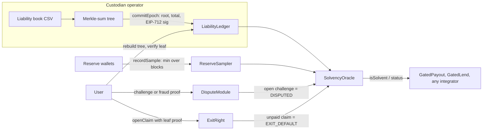

# ReserveProof: proof of reserves for USDG and Robinhood Stock Tokens

[](https://github.com/Assassin859/ReserveProof/actions/workflows/ci.yml)
[](https://github.com/Assassin859/ReserveProof/actions/workflows/ops-epoch.yml)
[](https://github.com/Assassin859/ReserveProof/actions/workflows/fork-drill.yml)

`USDG` · `Robinhood Chain` · `Robinhood Stock Tokens (ERC-8056)` · `Morpho Blue` · `Arbitrum`

Open-source proof of reserves and proof of exit for custodians of **USDG** and **Robinhood Stock Tokens**,
shipped as one modifier any lending market can add: `onlySolvent(asset)`.

**Live demo:** [reserveproof-teal.vercel.app](https://reserveproof-teal.vercel.app) (Kopi Wallet on Robinhood testnet and Arbitrum Sepolia)
· **150 tests** (`npm run test:count`) · every contract verified on both testnets
· **Check every claim in one click:** [reserveproof-teal.vercel.app/verify](https://reserveproof-teal.vercel.app/verify)

## Why

On Robinhood Chain mainnet today (block 75,032,783, 28 Sep 2026, [`npm run market:size`](scripts/market-size.ts),
raw output in [`docs/market-size.json`](docs/market-size.json)):

- **675.5M USDG** in circulation.
- **50 stock and ETF tokens are used as Morpho collateral**, with **$158.3M** of total supply between them
  (ERC-8056 tokens whose contract is listed in Robinhood's official asset registry, and all 50 are; stock
  tokens never posted on Morpho aren't counted).
- **167 Morpho Blue markets** lend USDG against those tokens: **745,012 USDG** supplied, **675,019 USDG**
  borrowed.
- **We found no reserve-proof oracle behind any of them.** Of the 167 distinct market oracles, 113 are
  Morpho's standard Chainlink-style oracle reading price feeds only (none of the feeds describes a reserve
  proof); the other 54 are custom contracts we couldn't classify. A Morpho market only asks its oracle for
  `price()`.

ReserveProof gives them that signal, fail-closed:

- On-chain reserve reads (multi-sample + live balance)
- Merkle-sum liabilities with user inclusion / omission proofs
- Fail-closed `isSolvent(custodianId, asset)` that payouts and lending can `require`
- **ExitRight** — bonded withdrawal with on-chain `settle`

**Where it fits: a price oracle checks the price; ReserveProof checks the backing.** A market's price oracle
stops it from lending on a stale or wrong price. It can't see a perfectly priced token whose custodian has
sold the stock behind it. ReserveProof can, and it doesn't judge the price, so the two stack in one
constructor, with the market's existing oracle as the base:

```solidity
new SolvencyGatedMorphoOracle(priceOracle, solvencyOracle, custodianId, TSLA, 72 hours, 6 hours, 5000);
```

Every live mainnet market, marked would gate / wouldn't / copycat:
[reserveproof-teal.vercel.app/radar](https://reserveproof-teal.vercel.app/radar).

See [docs/technical-spec.md](docs/technical-spec.md) for the full design.

Hackathon packet: [docs/SUBMISSION.md](docs/SUBMISSION.md) · [/verify](https://reserveproof-teal.vercel.app/verify) and [docs/VERIFY.md](docs/VERIFY.md) · [docs/FOUNDER-HOUSE.md](docs/FOUNDER-HOUSE.md) (go-to-market)

## How it works



1. **The custodian publishes** a sorted Merkle-sum root of what it owes per asset and per epoch, signed with a chain-agnostic EIP-712 commitment.
2. **The operator samples reserves.** `ReserveSampler.recordSample` is operator-gated; it records the reserve wallets' balances at several distinct blocks, and the oracle takes `min(samples, live balance)` against 103% of the allocation.
3. **The oracle answers** `isSolvent(custodianId, asset)` with a reason code (OK, STALE, DISPUTED, LIVE_SHORT, MULTIPLIER_DRIFT, EXIT_DEFAULT, …). It fails closed on anything it can't prove.
4. **Users verify** that their leaf is in the committed root. The Kopi UI rebuilds the tree in the browser.
5. **Anyone disputes.** Unanswered inclusion challenges, signed-statement mismatches and equivocation flip the oracle to DISPUTED.
6. **ExitRight** lets a user with a leaf proof open a bonded withdrawal claim. If the operator doesn't `settle` in time, the bond is slashed to the user and the asset is marked EXIT_DEFAULT.

## The product: any lending market adds one line, `onlySolvent(asset)`

```solidity
import {SolvencyGuard} from "reserveproof/src/guards/SolvencyGuard.sol";
import {ISolvencyOracle} from "reserveproof/src/interfaces/ISolvencyOracle.sol";

contract MyMarket is SolvencyGuard {
    constructor(ISolvencyOracle oracle, bytes32 custodianId) SolvencyGuard(oracle, custodianId) {}
    function borrow(uint256 amt) external onlySolvent(address(mTSLA)) { /* ... */ } // reverts Insolvent(reason)
}
```

[`src/examples/GuardedLendingVault.sol`](src/examples/GuardedLendingVault.sol) is a worked example: lenders
supply USDG, borrowers post mTSLA and borrow at 50% LTV. `borrow` stops the moment the custodian's proof
fails, and so does `withdrawCollateral` while the caller still has debt. Repaying, adding collateral and
withdrawing collateral with no debt never stop, so nobody is trapped while de-risking, even if a dispute
keeps the oracle red indefinitely. It is deployed and verified on both testnets, and the web simulator
shows it flipping from Allowed to `Insolvent (STALE)` etc. against the live contracts.

| Network | GuardedLendingVault | Demo borrower |
|---|---|---|
| Robinhood testnet | [`0xBf5E…b8eF`](https://explorer.testnet.chain.robinhood.com/address/0xBf5E41bEAE435E7D19F8dD4E6928e2c2a198b8eF#code) | 10 mTSLA collateral, owes 1 USDG; 4 USDG liquidity |
| Arbitrum Sepolia | [`0x2C2b…606C`](https://repo.sourcify.dev/421614/0x2C2b8B1BD101a177dee6C2f62ccED6C25e9a606C) | 10 mTSLA collateral, owes 1 USDG; 4 USDG liquidity (a mock USDG we own, [`0xa650…C35D`](https://repo.sourcify.dev/421614/0xa650A341583de45DfF8d5570236E39dfbf76C35D), since Paxos' test USDG isn't ours to mint) |

## Morpho Blue: wrap the oracle, not the market

Morpho markets are immutable, so the guard goes in front of the market's oracle:
[`SolvencyGatedMorphoOracle`](src/integrations/SolvencyGatedMorphoOracle.sol) forwards the base oracle's
`price()` and reverts `Insolvent(reason)` whenever the custodian's proof fails, for any reason.

```solidity
IOracle gated = new SolvencyGatedMorphoOracle(
    existingOracle, solvencyOracle, custodianId, TSLA,
    72 hours, // maxFreeze: how long one continuous failure blocks pricing
    6 hours,  // maxPokeGap: an incident clock nobody pokes for this long is void
    5000      // postCapBps: after maxFreeze, price at 50% of the base oracle
);
// createMarket({loanToken: USDG, collateralToken: TSLA, oracle: gated, irm, lltv})
```

**Every failed proof blocks.** `status()` reports only the first failing check, and `INACTIVE`, `NO_EPOCH`,
`STALE` and `INSUFFICIENT_SAMPLES` are checked before `LIVE_SHORT`. A wrapper that ignored any of them
could keep quoting full price while the reserves are drained behind that earlier reason.

The trade-off, stated plainly: Morpho calls `price()` in `borrow`, indebted `withdrawCollateral` and
`liquidate` alike, so while the wrapper reverts, underwater loans can't be liquidated either. So each
freeze is bounded:

- **One continuous incident.** Anyone can call `poke()` while the proof fails. The first poke starts the
  clock and later pokes keep it alive. If nobody pokes for `maxPokeGap`, the clock is void, and the next
  poke starts a new incident. A clock started during an earlier, since-restored shortfall therefore
  can't pre-pay the next freeze. A healthy poke clears it.
- **After the cap, a discounted price, not full value.** Once one incident has lasted `maxFreeze`,
  `price()` returns the base price times `postCapBps`. Underwater loans become liquidatable, and new
  borrowing reopens only at half value. Liquidators have every reason to keep poking.

The residual risk: a custodian can hold a visible failure for 72 hours while someone keeps poking, then
drain. By then the market has been frozen for three days, which is time for vault curators to pull
liquidity or set caps to zero, and it prices the collateral at half.

**The bound is per incident, not cumulative (CLOCK-RESET, open and disclosed).** A healthy poke clears
the clock, and a clock nobody pokes for 6 hours is void. So a custodian that restores reserves long
enough to pass a fresh proof (new samples and the live balance), then drains again, starts a new 72-hour
freeze, and can repeat the cycle. Each round needs the reserves genuinely back on chain. Each one is
public (`FreezeCleared` then `FreezeStarted`, and the freeze clock on [`/risk`](https://reserveproof-teal.vercel.app/risk)),
and the hourly [watchtower](.github/workflows/watchtower.yml) pokes, so a quiet spell can't void a live
clock. Carrying freeze time across incidents (a decaying freeze budget) is future work.

It reverts instead of returning 0 because a zero price would let liquidators seize every position for
free. `supply`, `withdraw`, `supplyCollateral`, `repay` and debt-free exits always work because Morpho
skips the oracle for positions without debt.
[`test/foundry/MorphoIntegration.t.sol`](test/foundry/MorphoIntegration.t.sol) runs each path against the
unmodified Morpho Blue v1.0.0 core, including:

- a drain hidden behind `INSUFFICIENT_SAMPLES`, `STALE` or `INACTIVE`;
- a pre-started clock;
- liquidation at the discounted price after the cap.

### Re-run the Morpho freeze yourself

One command, no keys, no gas, about 45 seconds (after `npm ci`):

```bash
npm run demo:morpho-fork
```

It forks Robinhood Chain mainnet in memory (nothing is broadcast) and deploys ReserveProof gating the
**real TSLA token**. It wraps the **real TSLA/USDG Morpho oracle** in `SolvencyGatedMorphoOracle`, then
opens a market on the **real Morpho Blue** (`0x9D53…1010`, real adaptive IRM, 77% LLTV). Then it drains the
reserve wallet and prints PASS/FAIL for every check. Only two things are simulated: token balances,
which are set in storage, and, from step 4 on, the feed transmitters. The real oracle rejects feed answers
older than 26 hours and a fork receives no new rounds, so before warping 72 hours the feed's latest real
answer is replayed with fresh timestamps. The script exits non-zero if any check fails.

This is fork-only today: nothing of ours is deployed on mainnet yet. The
[Fork drill](.github/workflows/fork-drill.yml) workflow runs the same command every day against the latest
mainnet block (`FORK_JSON=<path>` saves every check), and
[/verify](https://reserveproof-teal.vercel.app/verify#morpho-fork) shows the latest result.

```text
Step 2: custodian drains 990 of 1000 TSLA from the reserve wallet
  PASS  status reason is LIVE_SHORT (6)  (LIVE_SHORT)
  PASS  wrapper.price() reverts  (Insolvent(6))
  PASS  Morpho borrow(1 USDG) reverts  (Insolvent(6))
  PASS  Morpho indebted withdrawCollateral reverts  (Insolvent(6))
  PASS  Morpho liquidate reverts (no liquidation at a fake price)  (Insolvent(6))
Step 3: exits that need no price keep working
  PASS  borrower repay(100 USDG)
  PASS  borrower supplyCollateral(1 TSLA)
  PASS  lender withdraw(10,000 USDG)
Step 4: a keeper pokes every 5h through the 72h freeze
  PASS  price() still reverts at 71h (16 pokes)  (Insolvent(6))
  PASS  price() at 72h == 50% of the real oracle price  (179.6725 USDG/TSLA)
Step 5: liquidation clears at the discounted price
  PASS  liquidator seizes 1 TSLA  (received 1.0 TSLA for 167.275099 USDG)
Step 6: custodian restores reserves; a healthy poke clears the clock
  PASS  healthy poke emits FreezeCleared
  PASS  price() back to the full real oracle price  (359.345 USDG/TSLA)
  PASS  borrow(1 USDG) works again

ALL PASS: 20 checks on a Robinhood Chain mainnet fork against the real Morpho Blue
```

`FORK_RPC` and `FORK_BLOCK` override the fork source. The public RPC keeps only about 5,000 blocks of
state, so the default is the latest block. Offline, `forge test` covers the same paths against Morpho
Blue built from source.

| Network | SolvencyGatedMorphoOracle (mTSLA, base 250 USDG) |
|---|---|
| Robinhood testnet | [`0x55bc…847e`](https://explorer.testnet.chain.robinhood.com/address/0x55bcE99CF827F940D8138104e6dF0004630A847e#code) |
| Arbitrum Sepolia | [`0xdE3b…c1ea`](https://repo.sourcify.dev/421614/0xdE3be6d66148290316F6bb4638E1EfE3233bC1ea) |

## Stack

- Solidity 0.8.24
- Hardhat (compile / test)
- **150 tests** (`npm run test:count`, printed in CI): 51 Hardhat, 61 Foundry fuzz properties, 24 Foundry unit tests and 14 stateful invariants.
- **Fuzzed with Foundry:** property tests on `MerkleSumVerifier`, every `SolvencyOracle` reason code (coverage boundary, sample-dip window dressing, staleness, disputes, split drift, reason priority), the lending vault, registry and config ratchets, ledger commits and the Morpho wrapper inside a real Morpho Blue market.
- **Invariant-tested + Slither-scanned:** handler-driven invariants on the `DisputeModule` challenge queue (including equivocation and paged settlement), `ExitRight` bond accounting and the vault (no borrow while insolvent; repay and debt-free exit never blocked), plus a triaged Slither report: [docs/SECURITY-SCAN.md](docs/SECURITY-SCAN.md).
- OpenZeppelin Contracts 5.1.0
- Next.js + wagmi + viem demo UI (`packages/web`)

## Quick start

Prerequisites: Node 24 and npm 11 or newer (`npm ci` on npm 9/10 is rejected by `engine-strict`), plus
[Foundry](https://book.getfoundry.sh/getting-started/installation) for the fuzz and invariant suites.

```bash
npm ci
npm test
npm run build

# Foundry fuzz + invariant tests. lib/ is gitignored, so install the two libraries once first.
forge install foundry-rs/forge-std --no-git
forge install morpho-org/morpho-blue@v1.0.0 --no-git
forge test
npm run test:count

# Drain a custodian on a Robinhood Chain mainnet fork and watch the real Morpho Blue freeze (~45s)
npm run demo:morpho-fork
```

## Kopi Wallet UI

Hosted at [reserveproof-teal.vercel.app](https://reserveproof-teal.vercel.app), or `npm run demo:web` →
http://localhost:3000. The UI opens on the live **Robinhood testnet** deployment (switch to **Arbitrum
Sepolia** in the header). A live strip shows the latest epoch, when it was published, mTSLA coverage
against the 103% floor, and contract verification. **Local Hardhat** is offered only under `next dev`
(`packages/web/.env.development`), so the hosted site never calls 127.0.0.1.

- **Verify my balance:** enter an address (or press *Try demo user*). The browser rebuilds the
  Merkle-sum tree from the published book for the latest on-chain epoch, shows your leaf and proof path,
  and checks the computed root against the committed one.
- **What-if simulator:** *Drain reserves*, *Skip 8 days*, *Stock split* and *Fraud dispute* each run a
  read-only `eth_call` against the live contracts with one storage slot or the block time overridden, and
  show the oracle flip to LIVE_SHORT, STALE, MULTIPLIER_DRIFT or DISPUTED while `GatedPayout` and the
  lending vault revert `Insolvent`. No wallet, no gas. `npm run whatif:check:rh` / `whatif:check:arb`
  asserts the same results from the command line.
- **ExitRight:** live bond, in-flight bond, claim count and the recorded claim-and-settle transactions on
  Robinhood.

**Curator risk page:** [reserveproof-teal.vercel.app/risk](https://reserveproof-teal.vercel.app/risk) is
for vault curators and risk teams. It shows both testnets side by side and re-reads the chain every 30
seconds. For each custody proof it shows:
- coverage against the 103% floor, and the headroom: how far reserves can fall before `LIVE_SHORT`;
- time until the proof goes stale, compared with the next scheduled publish;
- open disputes, balance challenges and ExitRight claims.

It also lists every solvency-gated consumer (the payout, the lend/withdraw composer, the lending vault and
the Morpho oracle wrapper). For each one it shows what freezes, what stays open, what is exposed and the
wrapper's freeze clock, plus a "freezes if" list with the concrete thresholds. The same data is a JSON feed
at `/api/risk?network=robinhoodTestnet` (or `arbitrumSepolia`) for curators who want to poll it. Stock-token
cards also show the ERC-8056 multiplier: live `uiMultiplier` against the one committed in the epoch, plus any
scheduled change (`newUIMultiplier` with a future `effectiveAt`), which is exactly when the oracle returns
`MULTIPLIER_DRIFT`.

**Mainnet radar:** [reserveproof-teal.vercel.app/radar](https://reserveproof-teal.vercel.app/radar) reads
every Morpho Blue market on Robinhood Chain mainnet, live. It uses the Morpho API only for the market list,
Robinhood's official asset registry (`api.robinhood.com/rhj/assets`) for which token contracts are real,
and Multicall3 at one block for every number. Each market is marked:
- **would gate:** USDG or issuer-listed stock-token collateral. At block 75,749,646 that was 179 markets,
  with 707K USDG lent and 682K borrowed;
- **wouldn't gate:** crypto collateral, where there is no custodian to prove;
- **reject:** a copycat collateral or loan token. At that block, 6 markets lent one of two fake "USDG"
  tokens. One, [`0x8c86…7796`](https://robinhoodchain.blockscout.com/address/0x8c864e587d054cba3fc8d79054a700dc93988796),
  copies Paxos's exact name "Global Dollar" but has 0 decimals.

It also flags:
- pending corporate actions (an on-chain `newUIMultiplier` with a future `effectiveAt`, or a registry
  `pendingMultiplier`);
- multiplier mismatches between the chain and the registry;
- oracle prices more than 5% from the median for the same collateral and loan pair (a multiplier applied
  twice, or the wrong feed);
- reverting oracles.

None of these markets is gated today; the verdicts describe what our wrapper would do. The JSON is at
`/api/radar`, cached for 5 minutes.

After redeploying, publishing or changing contracts, run `npm run web:sync` to refresh the UI's ABIs,
testnet address books, liability books and ExitRight record.

## Local Kopi Wallet demo (no testnet gas)

```bash
# terminal A
npm run demo:node

# terminal B
npm run demo:setup     # deploy → CLI build → publish → sample → evm_snapshot
npm run demo:web       # → http://localhost:3000, pick "Local Hardhat"

# fail-closed scenes (against the running node)
SCENE=4 npm run demo:prepare   # drain → payout blocked
SCENE=5 npm run demo:prepare   # MULTIPLIER_DRIFT
npm run demo:warp              # or SCENE=6 npm run demo:prepare → STALE
SCENE=7 npm run demo:prepare   # DISPUTED

npm run demo:reset     # evm_revert to the post-setup snapshot (and re-snapshot)
```

The local book (`packages/cli/examples/liabilities.csv`) uses Hardhat accounts #2–#5, so challenges and
ExitRight claims can be signed locally.

Operator aliases: `ops:publish` (commitEpoch from `out/root.json`), `ops:sample` (recordSample).

## CLI — CSV → Merkle proofs

Build a sorted Merkle-sum tree and per-user proofs (leaf count must be a power of two: 2, 4, 8, …):

```bash
npm run cli:build -- \
  --csv packages/cli/examples/liabilities.csv \
  --custodian kopi \
  --asset 0xYourTokenAddress \
  --epoch 1 \
  --out ./out
```

CSV format (`user,amount`):

```text
user,amount
0x1111…1111,100000000000000000000
0x2222…2222,200000000000000000000
```

Outputs:

- `out/root.json` — root, total, sorted leaves
- `out/proofs/<address>.json` — inclusion proof nodes
- `out/neighbours/<address>.json` — neighbour bounds (omission disputes)

`--custodian` accepts a `bytes32` hex value or a string (hashed with `ethers.id`).

## Networks (test)

| Chain | ID | Notes |
|---|---|---|
| Robinhood Chain testnet | 46630 | RPC `https://rpc.testnet.chain.robinhood.com`; mTSLA + USDG books, ExitRight live |
| Arbitrum Sepolia | 421614 | Same contract addresses; mTSLA book (identical root to Robinhood) |

## Deploy

```bash
cp .env.example .env
# set DEPLOYER_PRIVATE_KEY=… (needs testnet ETH) and DEPLOYMENT_SALT=… (same value on every chain)

npm run wallets                          # gitignored reserve + demo-user keys (deployments/wallets.local.json)
RESERVE_WALLET_FUNDING=0 npm run deploy:rh    # Robinhood — official USDG 0x7E95…802F
RESERVE_WALLET_FUNDING=0 npm run deploy:arb   # Arbitrum Sepolia — official USDG 0xFFC9…0892
npm run verify:rh                        # Blockscout (FORCE=1 if a byte-identical redeploy shows as a "twin")
DEPLOYMENT=deployments/arbitrumSepolia.json npm run verify:sourcify
```

Address books land in [`deployments/`](deployments/). See [`deployments/README.md`](deployments/README.md).

Faucets: [Robinhood](https://faucet.testnet.chain.robinhood.com/) · [Paxos USDG](https://faucet.paxos.com/?network=robinhood) · [Chainlink Arb Sepolia](https://faucets.chain.link/arbitrum-sepolia)

Dry-run (no key): `npm run deploy` on the in-process Hardhat network.

## Testnet operations

```bash
npm run ops:cycle:rh      # build latest+1 from each book, commitEpoch, recordSample, print status
npm run ops:cycle:arb
npm run status:rh         # mTSLA + USDG oracle status
npm run exitright:setup   # post a 60 USDG bond, cap claims at 10 USDG each / 30 USDG in flight
npm run exitright:demo    # demo user opens a claim, operator settles it in the same run
```

Books live in [`scripts/books.ts`](scripts/books.ts) (`packages/cli/examples/testnet-*.csv`). The
[Ops epoch](.github/workflows/ops-epoch.yml) workflow runs the cycle every three days (well inside the
7-day `maxOracleAge`) and on demand. It needs the `DEPLOYER_PRIVATE_KEY` and `DEPLOYMENT_SALT`
repository secrets.

The hourly [Watchtower](.github/workflows/watchtower.yml) (`npm run watch:rh`, `watch:arb`;
`WATCH_ACT=0` for read-only) re-runs the cycle if a proof has under 72 hours left or fails for a reason
a fresh epoch fixes, pokes the Morpho wrapper, and fails the run on anything else: a failing proof, a
running freeze clock, an overdue challenge, a slashable exit claim. Set an `ALERT_WEBHOOK_URL` secret
(Discord or Slack) to be pinged as well. It shares a per-network concurrency group with Ops epoch, so
the two never send transactions from the deployer key at once.

[reserveproof-teal.vercel.app/status](https://reserveproof-teal.vercel.app/status) shows it all on one
page: every proof, the Morpho wrapper, the gated consumers, publisher gas, and the last 48 hourly
watchtower slots (GitHub cron runs late, so empty slots are shown rather than hidden).

**Settle every demo claim in the same session.** A claim left unsettled past its 72h payout window can
be slashed by anyone, which permanently flips that asset to EXIT_DEFAULT. `exitright:demo` opens and
settles in one run; `status:rh` lists any unsettled claim with its deadline.

## Residual risks (read before integrating)

- **Flash-loan / borrowed reserves:** samples use `min` across distinct `arbBlockNumber` values plus a time gap, then `min(sampleMin, liveBalance)`. Capital borrowed for the *entire* sampling window can still inflate reserves — documented, not fully eliminated.
- **Operator-only sampling:** only the custodian's operator can call `recordSample`, so it chooses when samples land. The oracle's `min(sampleMin, liveBalance)` means reserves must still be present when an integrator reads `isSolvent`. Permissionless sampling is future work.
- **Equivocation settlement is paged (SETTLE-1, fixed):** an equivocation proof used to refund every open challenge in one loop and ran out of block gas at roughly 909 challenges. It now settles at most 64 inline, and anyone can refund the rest with `settleChallengesAfterEquivocation(custodianId, asset, maxCount)`. The oracle reports DISPUTED from the moment the proof lands, whether or not every refund has been paged through yet. [`EquivocationSettlement.t.sol`](test/foundry/EquivocationSettlement.t.sol) lands a proof over 2,000 open challenges.
- **ExitRight bond ≠ full insurance:** the USDG bond is a deterrent with per-claim and in-flight caps. A bank run of many claims is an intentional stress case; unpaid claims beyond the bond still mark exit default.
- **Per-chain allocation:** `isSolvent` on one chain means that chain’s **allocation** is covered, not that 100% of global liabilities sit there. Treat “fully backed” as AND across chains in the UI.
- **Non-ZK omission:** users with a custodian-signed EIP-712 balance statement can prove omission via neighbours. Users with neither inclusion nor a statement cannot.
- **Issuer-controlled multiplier:** ERC-8056 `uiMultiplier` is controlled by the token issuer; ReserveProof fail-closes on drift until the custodian recommits.
- **Leaves bind the local token address:** a leaf commits to the asset's address on the chain it is published on. USDG's official addresses differ between Robinhood and Arbitrum, so a USDG inclusion proof only verifies on its home chain, and the testnets publish USDG on Robinhood only. Binding leaves to the cross-chain `assetId` instead is future work.
- **ExitRight default is permanent:** once any claim is slashed, `exitDefault[custodian][asset]` stays set and the oracle reports EXIT_DEFAULT for that asset for good. Anyone holding a leaf's key can open a claim, which is why the testnet book uses a private demo user rather than public Hardhat keys.

## License

MIT
